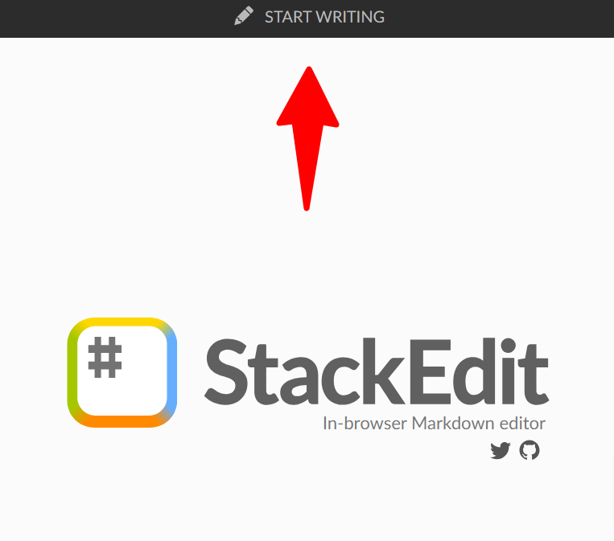
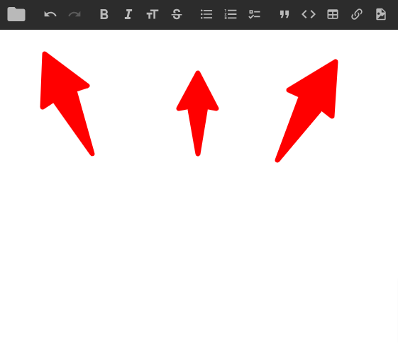
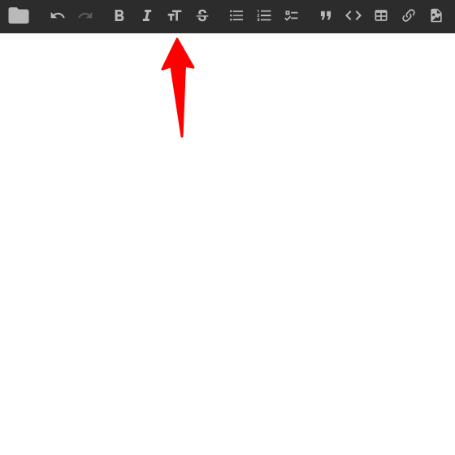
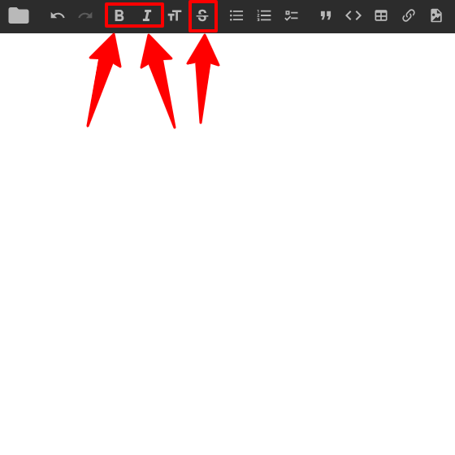
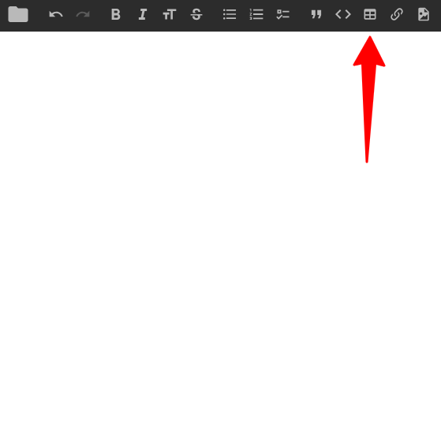

## Где я могу создать MD файл?

Для создания MD (Markdown) файлов существует множество онлайн сервисов, таких как
[StackEdit.io](https://stackedit.io/),
[Readme.so](https://readme.so/),
[Editor.md](http://editor.md.ipandao.com/),
[HedgeDoc](https://demo.hedgedoc.org/) - дай Бог им здоровья.
Также можно использовать настольное решение - в данный момент я пишу эту статью в редакторе
[VSCode](https://code.visualstudio.com/Download), такое решение даёт вам больше контроля
над публикацией контента.

Для эксперимента я рекоммендую Вам использовать решение от [StackEdit.io](https://stackedit.io/) - удобный интерфейс для новичков и возможность публикации в пару кликов.

1. Нажимаем на эту кнопку:
   
2. Удаляем весь демонстрационный контент.
3. Создаём статью с помощью данного пособия (можно пользоваться кнопками-помощниками сверху):
   

## Как создать заголовок?

> На каждой странице сайта есть заголовки, с помощью которых можно выделить
> важные темы на странице.

Заголовки бывают шести уровней:

# Заголовок первого уровня

```md
# Заголовок первого уровня
```

Такой заголовок рекомендуется использовать всего один раз на странице - он
говорит о самой важной теме страницы (_а также сообщает об этом поисковым системам_).

## Заголовок второго уровня

```md
## Заголовок второго уровня
```

Таким заголовком обычно выделяют основные разделы тематики страницы.

---

### Заголовок третьего уровня

#### Заголовок чертвёртого уровня

##### Заголовок пятого уровня

###### Заголовок шестого уровня

```md
### Заголовок третьего уровня

#### Заголовок чертвёртого уровня

##### Заголовок пятого уровня

###### Заголовок шестого уровня
```

Остальные заголовки служат для ветвления иерархии подтем: например, если у вашего заголовка
второго уровня появилась подтема - необходимо использовать заголовок третьего уровня, и т.д.

> Если вы пользуетесь [StackEdit.io](https://stackedit.io/) - быстро создать заголовок можно нажав на одну кнопку (повторное нажате меняет уровень):
> 

Также иерархия заголовков помогает SEO-ботам лучше искать информацию на странице, что повысит рейтинг сайта в поисковых системах (Яндекс, Google).

Больше информации о заголовках можете найти на сайте [DOKA](https://doka.guide/html/h1-h6/), либо в любых других открытых источниках.

## Как сделать параграф?

Параграф — это одна или несколько подряд идущих строчек текста, отделённых одной или несколькими пустыми строчками. Если строка содержит только пробелы или табы, то она всё равно считается пустой.

Подряд идущие строчки будут склеены в одну, если не добавить жёсткий перенос. Существует несколько способов, как это можно сделать:

- добавить два (или больше) пробелов в конце строки;
- добавить обратную косую черту в конце строки \\;

> Предпочтительным способом является косая черта.

**_Пример:_**

Привет,
мир!

Привет, _пробел пробел_  
пробел!

Привет,\
косая черта!

```md
Привет,
мир!

Привет, _пробел пробел_  
пробел!

Привет,\
косая черта!
```

## Как добавить список?

### Списки бывают двух видов

#### Упорядоченные

1. Хлеб
2. Молоко
3. Помидоры

```md
1. Хлеб
2. Молоко
3. Помидоры
```

и

#### Маркированные

- Помидор
- Огурец

```md
- Бублик
- Ватрушка
```

---

### Также списки могут быть вложенными

#### Упорядоченный в маркированном

- Хлеб
- Молочные продукты
  1. Кефир
  2. Ряженка

#### И наоборот, маркированный в упорядоченном

1. Молоко
2. Хлебобулочные изделия
   - Бублик
   - Ватрушка

## Выделение текста

Если обернуть текст нижними подчёркиваниями ( \_ ) - он станет курсивным.\
Если обернуть текст двумя парами звёздочек ( \*\* ) - он станет жирным.\
Если обернуть текст двумя парами тильд ( ~~ ) - он станет зачёркнутым.

**_Пример:_**

- одна пара нижних подчёркиваний сделает текст _курсивным_
- две пары звёздочек сделают текст **жирным**
- две пары тильд по краям сделают текст ~~зачёркнутым~~
- одна пара нижних подчёркиваний и две пары звёздочек сделают текст **_жирным курсивом_**

```md
- одна пара нижних подчёркиваний сделает текст _курсивным_
- две пары звёздочек сделают текст **жирным**
- две пары тильд по краям сделают текст ~~зачёркнутым~~
- одна пара нижних подчёркиваний и две пары звёздочек сделают текст **_жирным курсивом_**
```

> Если вы пользуетесь [StackEdit.io](https://stackedit.io/) - быстро применить выделение можно нажав на эти кнопки:
> 

## Как добавить таблицу?

Колонки таблицы размечаются с помощью вертикальных черт (|), а заголовок отделяется дефисами (-).

| Место | Участник | Рейтинг |
| ----- | -------- | ------- |
| 1     | Саша     | 118     |
| 2     | Юля      | 92      |
| 3     | Даниил   | 36      |

```md
| Место | Участник | Рейтинг |
| ----- | -------- | ------- |
| 1     | Саша     | 118     |
| 2     | Юля      | 92      |
| 3     | Даниил   | 36      |
```

> Можно пользоваться генераторами таблиц, например [tablesgenerator.com](https://www.tablesgenerator.com/markdown_tables).
> Также, если вы делаете публикацию в [StackEdit.io](https://stackedit.io/),
> можете воспользоваться встроенным генератором таблиц:
>
> 

## Публикация
